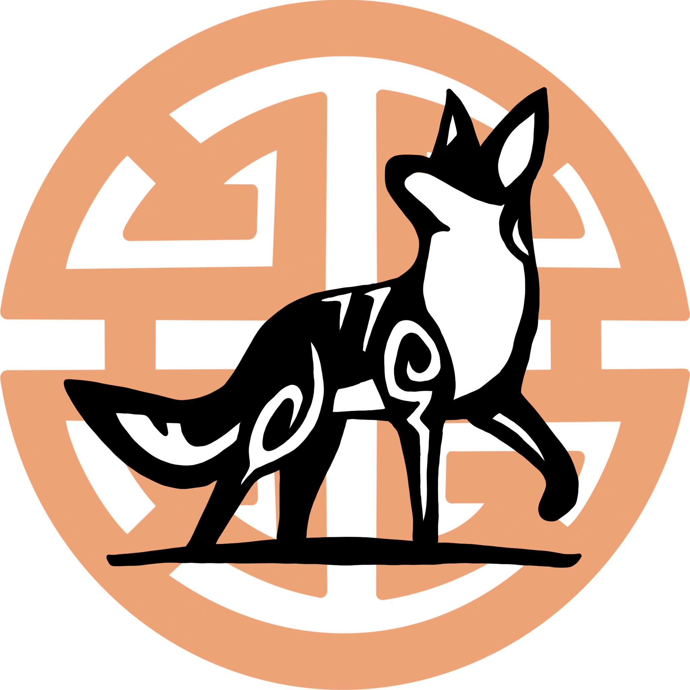
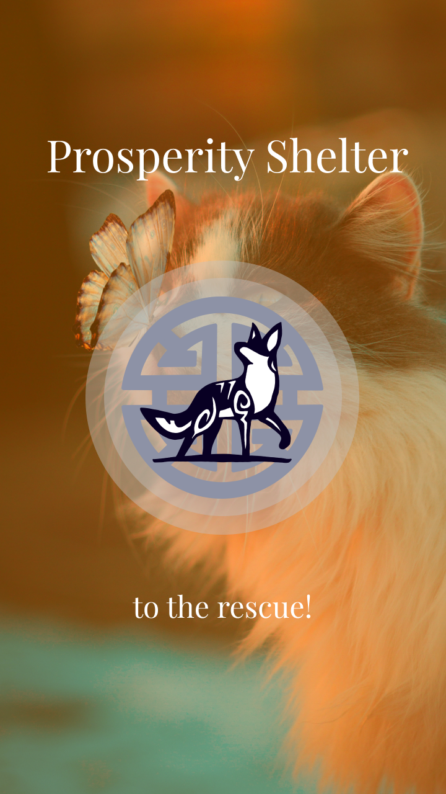
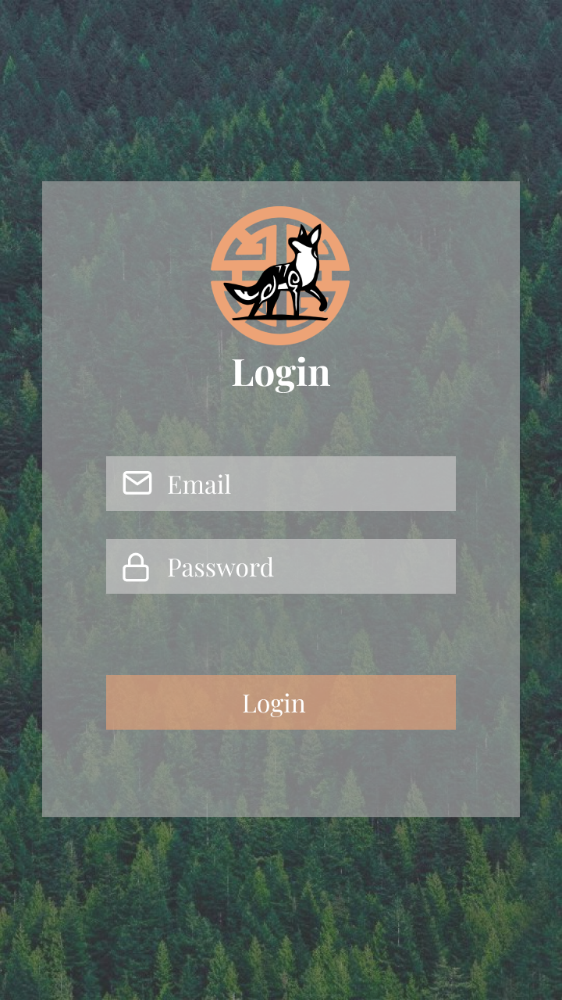
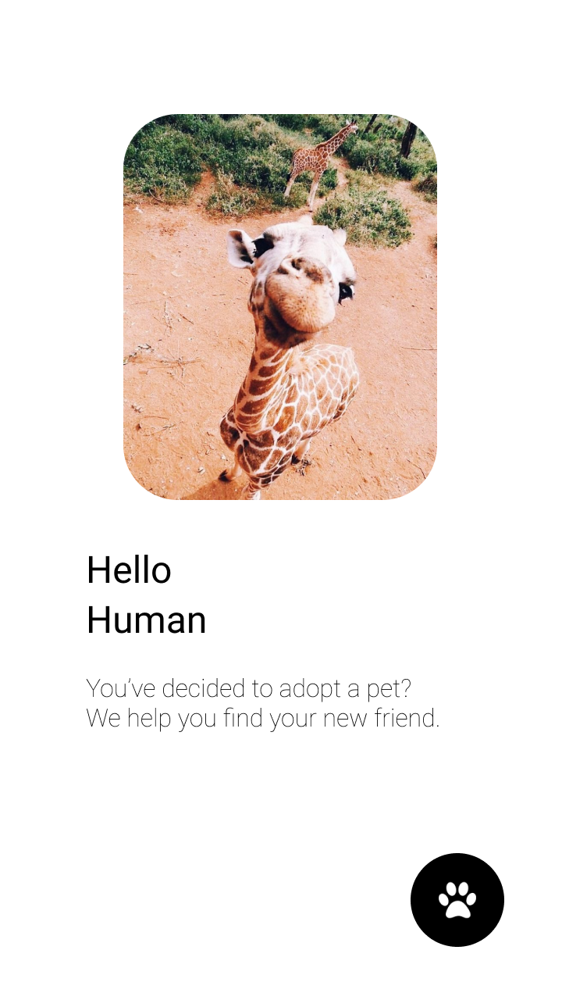
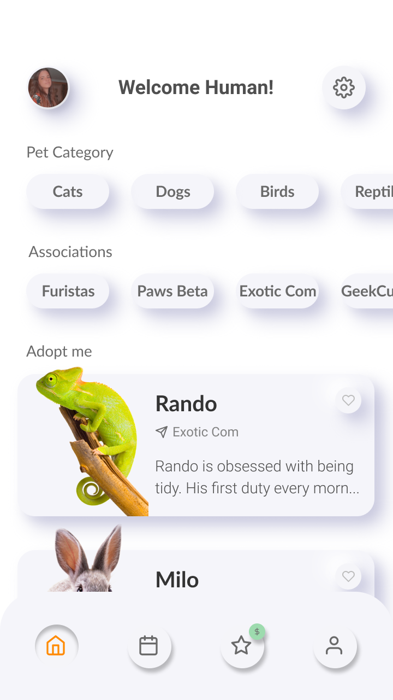
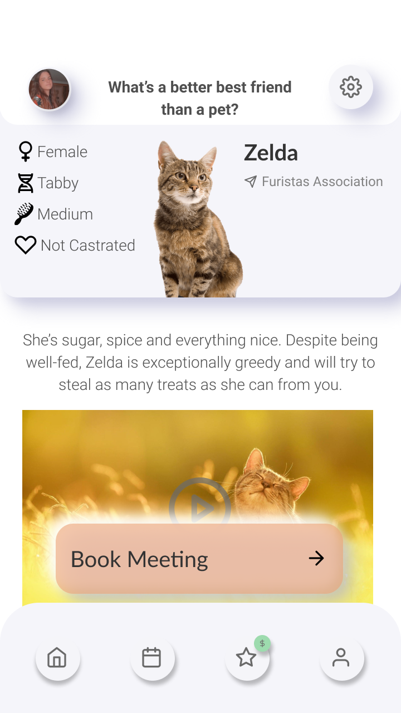

<!--
*** Thanks for checking out the Best-README-Template. If you have a suggestion
*** that would make this better, please fork the repo and create a pull request
*** or simply open an issue with the tag "enhancement".
*** Don't forget to give the project a star!
*** Thanks again! Now go create something AMAZING! :D
-->

<!-- PROJECT SHIELDS -->
<!--
*** I'm using markdown "reference style" links for readability.
*** Reference links are enclosed in brackets [ ] instead of parentheses ( ).
*** See the bottom of this document for the declaration of the reference variables
*** for contributors-url, forks-url, etc. This is an optional, concise syntax you may use.
*** https://www.markdownguide.org/basic-syntax/#reference-style-links
-->
[![LinkedIn][linkedin-shield]][linkedin-url]

<!-- PROJECT LOGO -->
 

  

<h3 align="center">Prosperity Shelter</h3>

  

    This type of project consists of developing an Android application based on a business plan, using a development process focused on user experience.
    The application is aimed at adopting animals and spreading knowledge about the responsibilities and commitments that a pet brings.
     
     
    >>
    <a href="https://github.com/github_username/repo_name/youtubevideo">View Demo</a>
    <<
  

<!-- ABOUT THE PROJECT -->
## About The Project

Prosperity Shelter is an Android application that aims to provide the user with animals for adoption, all the necessary information about them and provides some knowledge and care to take when adopting an animal, bringing new commitments and responsibilities that must be taken into account when adopting a new pet.

This should be an application made available to any user in a free, effective, efficient and intuitive way.

Due to the type of responsibilities and commitments that this application can potencially bring, the target audience will be focused on a more mature and older user group.

(<a href="#top">back to top</a>)

### Built With

* [Kotlin](https://nextjs.org/)
* [XML](https://reactjs.org/)
* [Android Studio](https://vuejs.org/)
* [Firebase](https://angular.io/)

(<a href="#top">back to top</a>)

<!-- CONTACT -->
## Contact

Email - beatrizsa1906@gmail.com

Portfolio - Still in Development

Itch.io - [https://barrythecoolbee.itch.io/](https://barrythecoolbee.itch.io/)

LinkedIn - [https://www.linkedin.com/in/beatriz-s%C3%A1-857a64222/](https://www.linkedin.com/in/beatriz-s%C3%A1-857a64222/)

Instagram - [https://www.instagram.com/barrythecoolbee/](https://www.instagram.com/barrythecoolbee/)

Youtube - [https://www.youtube.com/channel/UCuzo8NbNm7MCut_lDQ7WNvw](https://www.youtube.com/channel/UCuzo8NbNm7MCut_lDQ7WNvw)

ArtStation - [https://www.artstation.com/barrythecoolbee](https://www.artstation.com/barrythecoolbee)

Project Link: [https://github.com/barrythecoolbee/ProsperityShelterApp](https://github.com/barrythecoolbee/ProsperityShelterApp)

(<a href="#top">back to top</a>)

<!-- MARKDOWN LINKS & IMAGES -->
<!-- https://www.markdownguide.org/basic-syntax/#reference-style-links -->

[linkedin-shield]: https://img.shields.io/badge/-LinkedIn-black.svg?style=for-the-badge&logo=linkedin&colorB=555
[linkedin-url]: https://www.linkedin.com/in/beatriz-s%C3%A1-857a64222/
